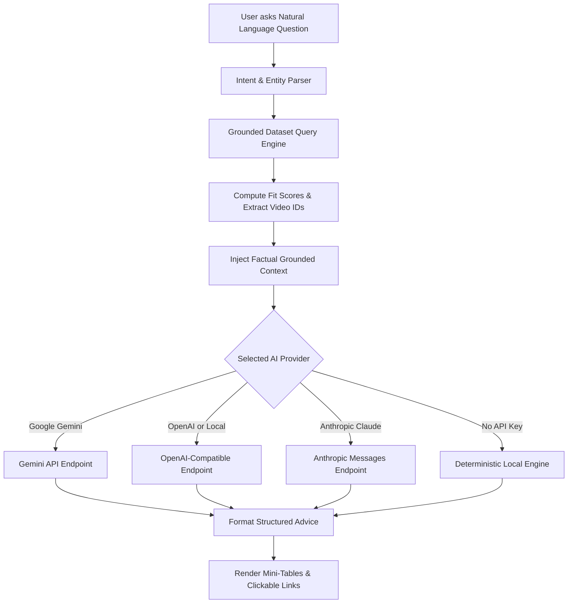

# Creator Partnership Pipeline: Talent Agency Intelligence

> Built for the **Head of Creator Partnerships** at a creative talent agency to rapidly identify high-impact TikTok creators based on **Verification Status**, active engagement (**Total Shares & Comments**), and verified dataset metrics from `provided_materials/2026datathon_interview_data.csv` using a **Model-Agnostic AI Architecture**.

---

## 1. High-Impact Creator Partnership Strategy

### Partnership Fit Score Architecture

The **Partnership Fit Score (up to 99%)** incorporates the strategic principle that **unverified accounts represent higher-upside, more accessible partnership targets** combined with active audience engagement metrics:

1. **Unverified Account Advantage (50% to 99% Score Range):**
   * **Unverified Accounts (759/802 creators, 94.6%):** Independent talent with high receptiveness to creative agency collaboration and brand deals.
   * **Base Score:** `50%`
   * **Shares (Virality):** Up to `+22 pts` (organic peer-to-peer distribution without paid ads).
   * **Comments (Community):** Up to `+22 pts` (active audience retention, discussion, and loyalty).
   * **Views (Reach):** Up to `+5 pts` (overall audience exposure).
2. **Verified Accounts (Hard Ceiling Capped at 50% Max):**
   * **Verified Accounts (43/802 creators, 5.4%):** Established enterprise, celebrity, or institutional accounts (e.g. `@billieeilish` = `50%`). These carry lower acquisition priority and higher friction due to existing management commitments.

---

## 2. Streamlined 3-Panel Architecture

```
┌──────────────────────────┬──────────────────────────┬──────────────────────────┐
│ PANEL 1: AI ASSISTANT    │ PANEL 2: CREATOR LEADS   │ PANEL 3: PROFILE & FEED  │
│ (Far-Left: 330px)        │ (Center: 300px)          │ (Right: 1fr)             │
│                          │                          │                          │
│ • Model-Agnostic Q&A     │ • Ranked by Fit Score    │ • Creator Profile Photo  │
│ • One-Click Lead Prompts │ • Sort: Shares, Comments,│ • Views, Shares, Comments│
│ • Multi-Provider Support │   Partnership Score, View│ • Verified video_id feed │
│ • Local Engine Fallback  │ • Filter: All/Unverified/│ • Direct TikTok Links    │
│                          │   Verified               │                          │
└──────────────────────────┴──────────────────────────┴──────────────────────────┘
```

1. **Panel 1 (Far-Left) — Conversational AI Assistant:**
   * Natural language partnership intelligence with one-click prompt chips (*"Top 5 by Total Shares"*, *"Top 5 by Total Comments"*, *"Top High-Impact Targets"*, *"Verified vs Unverified Breakdown"*).
2. **Panel 2 (Center) — Creator Leads & Sorting:**
   * Sortable roster by **Total Shares (Virality)**, **Total Comments (Community)**, **Partnership Fit Score**, and **Total Views (Reach)**.
   * Filter segments for *All (802)*, *Unverified (759)*, and *Verified (43)* with instant search.
3. **Panel 3 (Right) — Creator Profile & Video Evidence:**
   * Creator avatar, 3 primary metrics (Views, Shares, Comments), and engagement rationale.
   * Complete feed of associated videos referenced by exact **`video_id`** with direct links to watch on TikTok.

---

## 3. Model-Agnostic AI Integration

The conversational strategist is **100% Model-Agnostic** and includes a **Deterministic Local Engine:** with zero API keys required.



---

## 4. Ensuring Accuracy

1. **Deterministic Grounded Core:** All view counts, comment/share volumes, verification states, and `video_id`s are calculated in code before prompting the LLM.
2. **Explicit Dataset Citation:** System prompts and response footers explicitly cite and constrain answers to `provided_materials/2026datathon_interview_data.csv`.
3. **Low Temperature & Strict Prompts:** Model temperature is locked to `0.2` with instructions strictly forbidding ungrounded hallucinations.
4. **Direct Verification:** Every video entry includes the exact dataset `video_id` with a direct link to the TikTok post (`https://www.tiktok.com/@author/video/video_id`).

---

## 5. Interaction Color System

* **Action Color (Electric Cyan `#38bdf8`):** Strictly reserved across the entire UI for interactive affordances (buttons, links, active filters, selected creator highlight, and input focus outlines).
* **Static Data & Metrics (High-Contrast Neutrals `#f8fafc` / `#cbd5e1`):** Used for all numerical metrics, tables, and content labels to ensure instant visual scanability.

---

## 6. How to Run

```bash
python3 -m http.server 8080
```
Open **[http://localhost:8080](http://localhost:8080)** in any modern web browser.
