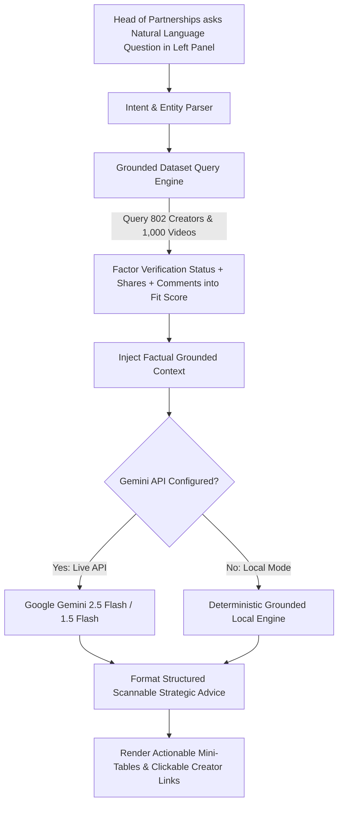

# Creator Partnership Pipeline: Talent Agency Intelligence

> Built for the **Head of Creator Partnerships** at a creative talent agency to rapidly identify high-impact TikTok creators based on **Verification Status**, active engagement (**Total Shares & Comments**), and verified dataset metrics using **Google Gemini AI**.

---

## 1. High-Impact Creator Partnership Strategy

### Partnership Fit Score Architecture

The **Partnership Fit Score (up to 99%)** incorporates the business assumption that **Unverified accounts are better partnership targets** combined with active audience engagement:

1. **Verification Status Factor (+25 pts for Unverified):**
   * **Unverified Accounts (759/802, 94.6%):** Highly accessible and receptive collaboration targets with strong agency partnership upside.
   * **Verified Accounts (43/802, 5.4%):** Established enterprise/celebrity accounts that typically carry existing representation and higher friction.
2. **Total Shares (Virality & Distribution):**
   * High share volume indicates organic peer-to-peer distribution without paid advertising.
3. **Total Comments (Community & Retention):**
   * High comment volume reflects community dialogue, audience loyalty, and active interaction.

---

## 2. Streamlined 3-Panel Architecture

```
┌──────────────────────────┬──────────────────────────┬──────────────────────────┐
│ PANEL 1: AI ASSISTANT    │ PANEL 2: CREATOR LEADS   │ PANEL 3: PROFILE & FEED  │
│ (Far-Left: 330px)        │ (Center: 300px)          │ (Right: 1fr)             │
│                          │                          │                          │
│ • Plain-English Q&A      │ • Ranked by Fit Score    │ • Creator Profile Photo  │
│ • One-Click Lead Prompts │ • Sort: Shares, Comments,│ • Views, Shares, Comments│
│ • Live Gemini API +      │   Partnership Score, View│ • Verified video_id feed │
│   Local Grounded Engine  │ • Filter: All/Unverified/│ • Direct TikTok Links    │
│                          │   Verified               │                          │
└──────────────────────────┴──────────────────────────┴──────────────────────────┘
```

---

## 3. Data Flow Architecture



---

## 4. Ensuring Accuracy

1. **Deterministic Grounded Core:** All view counts, comment/share volumes, verification states, and `video_id`s are calculated in code before prompting the LLM.
2. **Low Temperature & Strict Prompts:** Gemini is locked to `temperature: 0.2` and instructed to use only verified dataset facts.
3. **Direct Verification:** Every video entry includes the exact dataset `video_id` with a direct link to the TikTok post (`https://www.tiktok.com/@author/video/video_id`).

---

## 5. How to Run

```bash
python3 -m http.server 8080
```
Open **[http://localhost:8080](http://localhost:8080)** in any browser.
