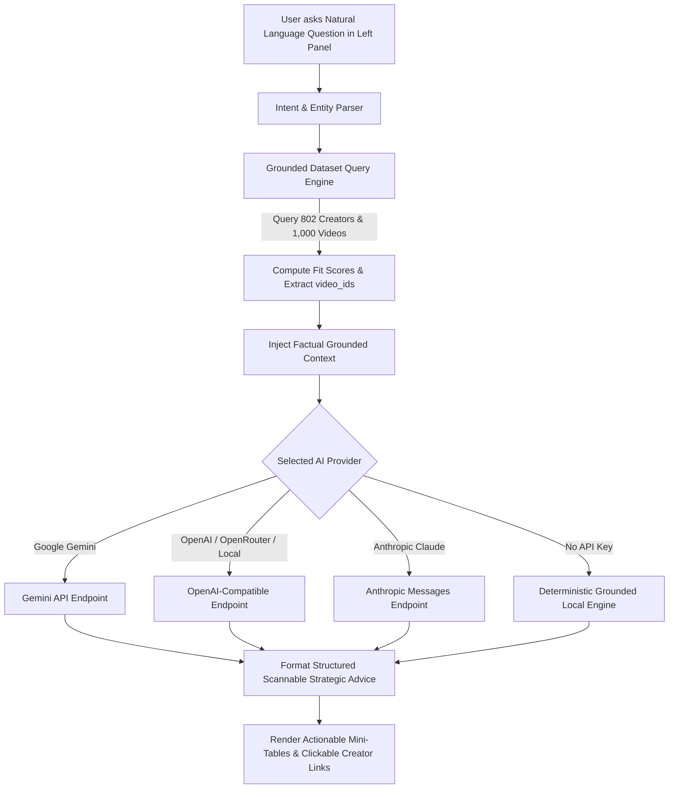

# Creator Partnership Pipeline: Talent Agency Intelligence

> Built for the **Head of Creator Partnerships** at a creative talent agency to rapidly identify high-impact TikTok creators based on **Verification Status**, active engagement (**Total Shares & Comments**), and verified dataset metrics using a **Model-Agnostic AI Architecture**.

---

## 1. High-Impact Creator Partnership Strategy

### Partnership Fit Score Architecture

The **Partnership Fit Score (up to 99%)** incorporates the business assumption that **Unverified accounts are prime partnership targets** combined with active audience engagement:

1. **Unverified Accounts (Prime Targets: 50% to 99%):**
   * **Base Score:** `50%`
   * **Shares (Virality):** Up to `+22 pts`
   * **Comments (Community):** Up to `+22 pts`
   * **Views (Reach):** Up to `+5 pts`
   * High collaboration receptiveness and accessibility.
2. **Verified Accounts (Hard Ceiling Capped at 50% Max):**
   * Verified accounts (e.g. `@billieeilish` = `50%`) carry high friction and low acquisition priority due to existing enterprise talent representation.

---

## 2. Streamlined 3-Panel Architecture

```
┌──────────────────────────┬──────────────────────────┬──────────────────────────┐
│ PANEL 1: AI ASSISTANT    │ PANEL 2: CREATOR LEADS   │ PANEL 3: PROFILE & FEED  │
│ (Far-Left: 330px)        │ (Center: 300px)          │ (Right: 1fr)             │
│                          │                          │                          │
│ • Model-Agnostic Q&A     │ • Ranked by Fit Score    │ • Creator Profile Photo  │
│ • One-Click Lead Prompts │ • Sort: Shares, Comments,│ • Views, Shares, Comments│
│ • Multi-Provider Support │   Partnership Score, View│ • Verified video_id feed │
│ • Local Engine Fallback  │ • Filter: All/Unverified/│ • Direct TikTok Links    │
│                          │   Verified               │                          │
└──────────────────────────┴──────────────────────────┴──────────────────────────┘
```

---

## 3. Model-Agnostic AI Integration

The conversational strategist is **100% Model-Agnostic** and seamlessly supports:

* **Google Gemini:** `gemini-2.5-flash`, `gemini-1.5-flash`, `gemini-1.5-pro`
* **OpenAI:** `gpt-4o`, `gpt-4o-mini`, `gpt-3.5-turbo`
* **Anthropic Claude:** `claude-3-5-sonnet-20241022`, `claude-3-haiku`
* **OpenRouter / Groq:** Multi-model inference gateway
* **Custom & Local Endpoints:** Ollama (`http://localhost:11434/v1`), vLLM, LM Studio
* **Zero API Key / Offline Mode:** Deterministic Grounded Analytics Engine



---

## 4. Ensuring Accuracy

1. **Deterministic Grounded Core:** All view counts, comment/share volumes, verification states, and `video_id`s are calculated in code before prompting the LLM.
2. **Low Temperature & Strict Prompts:** Model temperature is locked to `0.2` with instructions strictly forbidding ungrounded hallucinations.
3. **Direct Verification:** Every video entry includes the exact dataset `video_id` with a direct link to the TikTok post (`https://www.tiktok.com/@author/video/video_id`).

---

## 5. How to Run

```bash
python3 -m http.server 8080
```
Open **[http://localhost:8080](http://localhost:8080)** in any browser.
